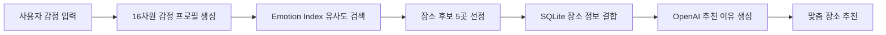
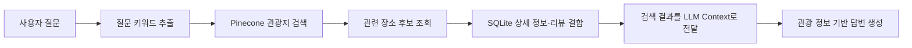

# Seoullo

서울 관광 공공데이터와 사용자 등록 장소를 함께 탐색하고, 감정 기반 추천·지도·별점 리뷰·챗봇을 제공하는 모바일 우선 웹 서비스입니다.

## 주요 기능

- 장소 검색, 카테고리 필터, 좋아요·조회수 정렬 및 Kakao 지도 탐색
- 익명 사용자 장소 CRUD, 이미지 업로드, 태그, 별점 리뷰와 좋아요
- 로컬 스토리지 기반 북마크와 중복 조회 방지
- 16차원 감정 프로필 유사도를 이용한 장소 5곳 추천과 AI 추천 이유
- 여행 후 감정 체크인에 따른 장소 감정 프로필 갱신
- Pinecone 검색과 SQLite 데이터를 결합한 관광 챗봇

# Seoullo

서울 관광 공공데이터와 사용자 등록 장소를 함께 탐색하고, 감정 기반 추천·지도·별점 리뷰·챗봇을 제공하는 모바일 우선 웹 서비스입니다.

## 주요 기능

- 장소 검색, 카테고리 필터, 좋아요·조회수 정렬 및 Kakao 지도 탐색
- 익명 사용자 장소 CRUD, 이미지 업로드, 태그, 별점 리뷰와 좋아요
- 로컬 스토리지 기반 북마크와 중복 조회 방지
- 16차원 감정 프로필 유사도를 이용한 장소 5곳 추천과 AI 추천 이유
- 여행 후 감정 체크인에 따른 장소 감정 프로필 갱신
- Pinecone 검색과 SQLite 데이터를 결합한 관광 챗봇

## 기술 구성

| 영역 | 기술 |
|---|---|
| Frontend | Vue 3, Vite, TypeScript |
| Backend | FastAPI, SQLAlchemy, Pydantic |
| Database | SQLite, Alembic |
| Search | Pinecone sparse lexical index, 16차원 emotion index |
| External API | Kakao Map/Local API, OpenAI API |

## 저장소 구조

```text
frontend/   Vue SPA
backend/    FastAPI 애플리케이션, 마이그레이션, 테스트
data/서울/  한국관광공사 원본 JSON
database/   로컬 SQLite 생성 위치
docs/       최종 기술 문서
```

## 로컬 실행

프로젝트 루트의 `.env`에 필요한 키와 설정을 입력합니다. 실제 키가 포함된 `.env`는 Git에 커밋하지 않습니다.

```powershell
# Backend
cd backend
python -m venv .venv
.venv\Scripts\Activate.ps1
pip install -r requirements-dev.txt
uvicorn app.main:app --reload
```

새 터미널에서 프론트엔드를 실행합니다.

```powershell
pnpm install
pnpm --dir frontend dev
```

- Frontend: `http://localhost:5173`
- Backend API: `http://localhost:8000/api`
- Swagger UI: `http://localhost:8000/docs`

서버 시작 시 SQLite 스키마를 준비하고 원본 JSON을 중복 안전하게 적재합니다. 주소가 비어 있는 여행코스는 Kakao 역지오코딩으로 주소를 산출해 DB에만 저장하며, 원본 JSON은 변경하지 않습니다.

## 문서

- [아키텍처와 데이터 흐름](docs/architecture.md)
- [API 명세](docs/api.md)
- [DDL 정의서](docs/ddl-definition.md)
- [Netlify·Render 배포 가이드](docs/deployment.md)

## 검증 명령

```powershell
cd backend
pytest

cd ..
pnpm --dir frontend build
```

## AI 추천 동작 방식



1. 사용자의 현재 감정과 여행 후 기대 감정을 입력받습니다.
2. 입력값을 `16차원 감정 프로필`로 변환합니다.
3. Pinecone의 `emotion index`에서 감정 프로필이 유사한 장소를 검색합니다.
4. 검색된 장소의 상세 정보와 별점·리뷰 데이터를 SQLite에서 조회합니다.
5. LLM이 사용자 감정과 장소 특징을 바탕으로 추천 이유를 생성합니다.
6. 최종적으로 사용자에게 맞는 장소 5곳과 추천 이유를 제공합니다.

## 관광 챗봇 RAG 동작 방식



> 관광 챗봇은 사용자의 질문과 관련된 장소를 먼저 검색한 뒤, 실제 데이터베이스에 저장된 장소 정보와 리뷰를 근거로 답변합니다. 이를 통해 LLM이 임의로 장소 정보를 생성하는 것을 줄이고, 서비스에 등록된 관광 정보를 중심으로 응답합니다.

## 기술 구성

| 영역 | 기술 |
|---|---|
| Frontend | Vue 3, Vite, TypeScript |
| Backend | FastAPI, SQLAlchemy, Pydantic |
| Database | SQLite, Alembic |
| Search | Pinecone sparse lexical index, 16차원 emotion index |
| External API | Kakao Map/Local API, OpenAI API |

## 저장소 구조

```text
frontend/   Vue SPA
backend/    FastAPI 애플리케이션, 마이그레이션, 테스트
data/서울/  한국관광공사 원본 JSON
database/   로컬 SQLite 생성 위치
docs/       최종 기술 문서
```

## 팀원 소개

<table>
  <tr>
    <td align="center">
      <a href="https://github.com/Wooniq">
        <br />
        <sub><b>한지운</b></sub>
      </a>
      <br />
      <sub>AI</sub>
      <br />
      <sub>감정 분석 · RAG 파이프라인 설계<br />LLM 추천 로직 구현</sub>
    </td>
    <td align="center">
      <a href="https://github.com/lepe99">
        <br />
        <sub><b>이원재</b></sub>
      </a>
      <br />
      <sub>Frontend · Backend</sub>
      <br />
      <sub>Vue 모바일 웹 개발<br />FastAPI 서버 개발 및 배포</sub>
    </td>
    <td align="center">
      <a href="https://github.com/portfolio-yk">
        <br />
        <sub><b>김예강</b></sub>
      </a>
      <br />
      <sub>발표 준비 · 총괄</sub>
      <br />
      <sub>프로젝트 기획 및 일정 관리<br />발표 자료 제작 및 발표 총괄</sub>
    </td>
  </tr>
</table>

## 로컬 실행

프로젝트 루트의 `.env`에 필요한 키와 설정을 입력합니다. 실제 키가 포함된 `.env`는 Git에 커밋하지 않습니다.

```powershell
# Backend
cd backend
python -m venv .venv
.venv\Scripts\Activate.ps1
pip install -r requirements-dev.txt
uvicorn app.main:app --reload
```

새 터미널에서 프론트엔드를 실행합니다.

```powershell
pnpm install
pnpm --dir frontend dev
```

- Frontend: `http://localhost:5173`
- Backend API: `http://localhost:8000/api`
- Swagger UI: `http://localhost:8000/docs`

서버 시작 시 SQLite 스키마를 준비하고 원본 JSON을 중복 안전하게 적재합니다. 주소가 비어 있는 여행코스는 Kakao 역지오코딩으로 주소를 산출해 DB에만 저장하며, 원본 JSON은 변경하지 않습니다.

## 문서

- [아키텍처와 데이터 흐름](docs/architecture.md)
- [API 명세](docs/api.md)
- [DDL 정의서](docs/ddl-definition.md)
- [Netlify·Render 배포 가이드](docs/deployment.md)

## 검증 명령

```powershell
cd backend
pytest

cd ..
pnpm --dir frontend build
```

## 데이터 출처

한국관광공사 TourAPI 4.0의 관광지, 문화시설, 축제공연행사, 여행코스, 레포츠, 숙박, 쇼핑 데이터를 사용합니다. 원본 JSON은 수정하지 않으며 라이선스는 공공누리 제1유형 기준입니다. 음식점 원본 JSON은 적재 대상에 포함되지 않습니다.
