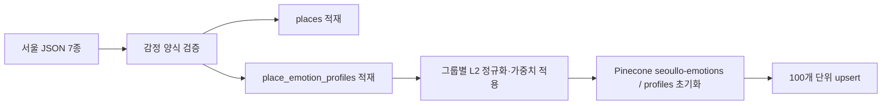

# 감정 Vector DB 구축 정의

## 1. 목적과 분리 원칙

감정 추천은 AI 임베딩이 아니라 고정된 16개 수치를 사용합니다. 기존 장소 RAG는 OpenAI의 1,536차원 텍스트 임베딩을 사용하므로 Pinecone 인덱스 차원이 서로 다릅니다. Pinecone 인덱스는 생성 후 차원을 혼합할 수 없기 때문에 두 인덱스를 분리합니다.

| 용도 | 인덱스 | 차원 | Metric | Namespace | OpenAI 필요 |
|---|---|---:|---|---|---:|
| 장소·챗봇 RAG | `seoullo` | 1,536 | cosine | `places` 등 | 필요 |
| 감정 추천 | `seoullo-emotions` | 16 | cosine | `profiles` | 불필요 |

## 2. 벡터 순서

벡터 순서는 코드에서 고정되며 변경할 수 없습니다.

| Index | 그룹 | 키워드 | DB 컬럼 |
|---:|---|---|---|
| 0 | mood | 지침 | `mood_fatigue` |
| 1 | mood | 불안 | `mood_anxiety` |
| 2 | mood | 답답함 | `mood_stifled` |
| 3 | mood | 설렘 | `mood_excitement` |
| 4 | mood | 외로움 | `mood_loneliness` |
| 5 | mood | 평온함 | `mood_calm` |
| 6 | afterFeeling | 회복 | `after_recovery` |
| 7 | afterFeeling | 해방 | `after_release` |
| 8 | afterFeeling | 활력 | `after_vitality` |
| 9 | afterFeeling | 위로 | `after_comfort` |
| 10 | afterFeeling | 몰입 | `after_immersion` |
| 11 | afterFeeling | 설렘 | `after_excitement` |
| 12 | style | 조용히 혼자 | `style_quiet_solo` |
| 13 | style | 가볍게 산책 | `style_light_walk` |
| 14 | style | 새로운 자극 | `style_new_stimulation` |
| 15 | style | 누군가와 함께 | `style_together` |

## 3. 정규화와 가중치

누적 체크인이 많은 장소가 숫자 크기만으로 유리해지지 않도록 각 그룹을 독립적으로 L2 정규화합니다. 정규화 후 그룹 가중치의 제곱근을 곱합니다.

```text
group_vector = raw_group / ||raw_group||₂ × √group_weight

mood         = 0.40
afterFeeling = 0.35
style        = 0.25
```

세 그룹에 값이 있는 장소 벡터의 전체 L2 norm은 1입니다. 7단계에서 사용자 선택도 같은 방식으로 벡터화하면 Pinecone cosine score가 그룹 가중 유사도가 됩니다.

## 4. Pinecone 레코드

```json
{
  "id": "emotion:123",
  "values": ["16개의 정규화된 실수"],
  "metadata": {
    "place_id": 123,
    "content_id": "1059877",
    "source": "dataset",
    "title": "양화한강공원",
    "content_type_id": "12",
    "content_type": "관광지",
    "region": "서울",
    "emotion_total": 49
  }
}
```

16개 값이 전부 0인 사용자 장소는 cosine 검색 의미가 없으므로 Pinecone에 넣지 않습니다. 체크인이 발생해 값이 생기면 해당 장소만 upsert합니다.

## 5. 전체 구축 흐름



전체 재구축 시 기존 감정 namespace를 `delete_all`로 비운 후 SQLite 값을 100개씩 upsert합니다. 같은 이름의 기존 Pinecone 인덱스가 16차원이 아니면 자동으로 재사용하지 않고 오류를 발생시킵니다.

## 6. 실행 명령

```powershell
# JSON 좌표와 감정 양식 검증
python -m app.scripts.validate_data

# SQLite 초기화 + 감정 Pinecone 인덱스만 재구축
python -m app.scripts.rebuild_pinecone --emotion-only

# 현재 SQLite를 유지하고 감정 인덱스만 재구축
python -m app.scripts.rebuild_pinecone --emotion-only --skip-db-reset

# SQLite, 감정 인덱스, 장소 RAG 인덱스 전체 재구축
python -m app.scripts.rebuild_pinecone
```

필수 환경변수:

```env
PINECONE_API_KEY=
PINECONE_EMOTION_INDEX_NAME=seoullo-emotions
PINECONE_EMOTION_NAMESPACE=profiles
PINECONE_CLOUD=aws
PINECONE_REGION=us-east-1
```

감정 인덱스는 OpenAI API 키를 사용하지 않습니다. 전체 장소 RAG까지 함께 구축할 때만 `OPENAI_API_KEY`가 필요합니다.

## 7. 체크인 동기화

9단계에서 체크인 트랜잭션이 SQLite의 선택 컬럼을 1씩 증가시킨 다음 `upsert_emotion_place(place_id)`를 호출합니다. 이 함수는 해당 장소 한 건만 다시 정규화하여 Pinecone에 upsert하므로 전체 인덱스를 다시 만들 필요가 없습니다.

DB 업데이트는 성공했지만 Pinecone 갱신이 실패하면 재시도 가능한 동기화 상태를 남기는 보상 로직을 9단계에서 추가합니다.

